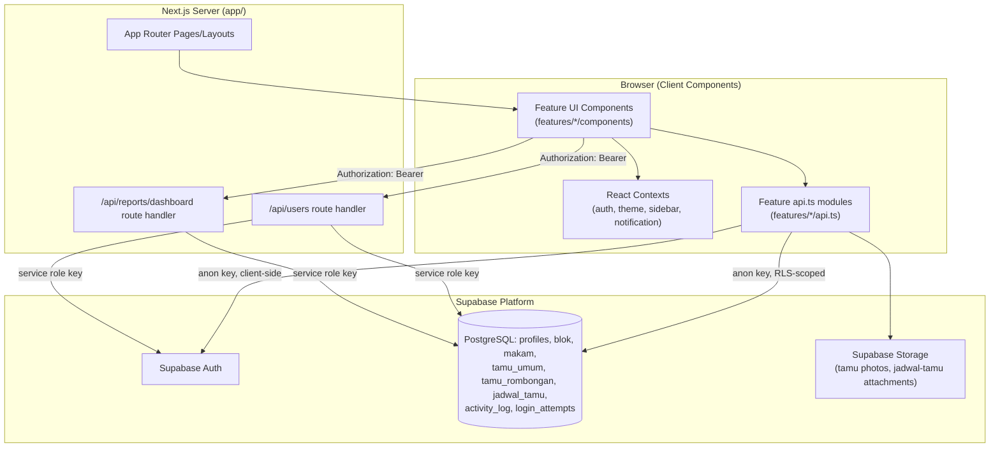

# TMP Project

## Overview

TMP Project is a Next.js 14 (App Router) web dashboard for administering a **Taman Makam Pahlawan** (heroes' cemetery), as stated in the application metadata: `"Sistem Administrasi Taman Makam Pahlawan"` (`app/layout.tsx`). The application manages visitor registration (`tamu`), grave/cemetery-block records (`makam`, `blok`), scheduled visits/events (`jadwal_tamu`), user accounts, and system notifications, backed by Supabase (PostgreSQL + Auth + Storage).

The application is a single Next.js project (frontend + API routes in one codebase), with Supabase as the sole backend/data platform. There is no separate backend service in the repository.

## Key Features

Based on the `features/` directory and corresponding routes under `app/(dashboard)/`:

- **Visitor intake (`tamu`)** — register individual (`tamu-umum`) and group (`tamu-rombongan`) visitors, including photo capture, and view/edit/delete a visitor list (`daftar-tamu`).
- **Visit scheduling (`jadwal-tamu`)** — calendar-based scheduling of activities/events with month/week/year views, attachments, and conflict detection (`ConflictConfirmDialog.tsx`).
- **Grave records (`makam`)** — list, search, sort, and manage grave records tied to cemetery blocks.
- **Cemetery blocks (`blok`)** — manage block capacity and occupancy (`kapasitas`, `terisi`).
- **User management (`user-management`)** — create/edit/delete/deactivate user accounts; restricted to the `master` role (`features/user`, `app/api/users/route.ts`).
- **Notifications (`notifikasi`)** — upcoming/past event reminders and security alerts (e.g. failed login streaks), computed from `jadwal_tamu` and related tables (`features/notifikasi/api.ts`).
- **Dashboard reporting** — a dashboard overview (`features/dashboard`) with a server-generated PDF export (`app/api/reports/dashboard/route.ts`, `lib/reports/dashboard-report.ts`, using `pdfkit`).
- **Activity log** — an audit trail of create/update/delete/export actions (`lib/activity-log.ts`, `activity_log` table, migration `20260804_activity_log.sql`).

No functionality beyond what is listed above was identified in the repository.

## Architecture

### Architecture Overview

The project follows a **feature-based architecture** layered on top of the Next.js App Router:

- `app/` — routing, layouts, and the only two API route handlers in the project.
- `features/<domain>/` — per-domain UI components, hooks, and data-access (`api.ts`) modules (`tamu`, `jadwal-tamu`, `blok`, `makam`, `user`, `notifikasi`, `dashboard`, `auth`).
- `lib/` — cross-cutting infrastructure: Supabase clients, React Contexts (auth, theme, sidebar, notifications), activity logging, PDF report generation, and shared utilities.
- `components/ui/` — shared, non-domain-specific UI primitives (Sidebar, Toast, LoadingButton, CameraCapture, etc.).
- `types/index.ts` — a single shared TypeScript type module for domain entities.
- `supabase/` and `supabase-schema.sql` — database schema and migrations (source of truth for the data model).

This is **not** a strictly layered (controller/service/repository) architecture. Each feature's `api.ts` talks directly to Supabase (via `supabaseClient`) from the client, combining what would elsewhere be "service" and "data access" responsibilities. There is no dedicated service layer, repository layer, or dependency-injection mechanism.

### Architecture Diagram



### Application Layers

| Layer | Present? | Location | Notes |
|---|---|---|---|
| Presentation / routing | Yes | `app/` | App Router pages, layouts, route groups |
| UI / component layer | Yes | `features/*/components`, `components/ui` | Client components (`'use client'`) |
| Feature/domain logic | Yes | `features/*` | Colocated components, hooks, `api.ts` |
| Data access | Merged into feature layer | `features/*/api.ts` | Direct Supabase queries; no separate repository layer |
| Server API layer | Minimal | `app/api/users`, `app/api/reports/dashboard` | Only 2 route handlers exist |
| Infrastructure / cross-cutting | Yes | `lib/` | Supabase clients, contexts, activity log, PDF reports |
| Database | Yes | `supabase-schema.sql`, `supabase/migrations` | PostgreSQL via Supabase, with Row Level Security policies |

### Data Flow

**Read/write flow for most domain features (e.g. visitor intake, grave records, blocks):**

```text
User (browser)
 ↓
Feature UI component ('use client')
 ↓
features/<domain>/api.ts function
 ↓
supabaseClient (anon key, browser-side, RLS-enforced)
 ↓
Supabase PostgreSQL / Storage
 ↓
Response mapped from snake_case row → camelCase domain type (types/index.ts)
 ↓
React state update in the component/hook
 ↓
UI re-render
```

**Privileged flow for user management and dashboard PDF export:**

```text
User (browser, must already hold a Supabase session)
 ↓
Feature UI component reads the current session's access token
 ↓
fetch() to /api/users or /api/reports/dashboard with "Authorization: Bearer <token>"
 ↓
Next.js Route Handler
 ↓
createServerSupabaseClient() (service role key)
 ↓
serverClient.auth.getUser(token) — verifies the caller
 ↓
Query "profiles" table to confirm caller.role === 'master'
 ↓
Perform privileged operation (create/delete user via Supabase Auth Admin API,
 or query + build a PDF via pdfkit)
 ↓
Write an activity_log entry
 ↓
JSON or PDF response back to the browser
```

Both API route handlers (`app/api/users/route.ts`, `app/api/reports/dashboard/route.ts`) independently re-verify the bearer token and the caller's `master` role server-side before performing any privileged action; this authorization check was not found to be centralized (e.g. no shared middleware or wrapper function performs it).

## Technology Stack

| Layer | Technology | Role |
|---|---|---|
| Framework | Next.js 14.2.5 (App Router) | Routing, rendering, API route handlers |
| Language | TypeScript (`strict: true`) | Application language |
| UI runtime | React 18 | Component rendering |
| Styling | Tailwind CSS 3, `tailwindcss-animate`, `tailwind-merge`, `clsx` | Utility-first styling and conditional class composition |
| Icons | `lucide-react` | Icon set used across UI components |
| Charts | `recharts` | Dashboard data visualization |
| 3D | `three` (+ `@types/three`) | Present as a dependency; usage was not exhaustively traced beyond dependency declaration — see *Documentation Gaps* |
| Backend platform | Supabase (`@supabase/supabase-js`) | Auth, PostgreSQL database, file storage |
| PDF generation | `pdfkit` (+ `@types/pdfkit`) | Server-side dashboard report export (`lib/reports`) |
| Dates | `date-fns` | Date formatting/manipulation |
| Linting | `next lint` (ESLint via Next.js) | Code linting; no standalone `.eslintrc` file was found in the repository |
| Formatting | Not found in the repository | No Prettier configuration file was identified |
| Testing | Not found in the repository | No test files, test runner, or test script were identified |
| CI/CD | Not found in the repository | No GitHub Actions/GitLab CI configuration was identified |
| Deployment | Not found in the repository | No Dockerfile, Vercel, or other deployment configuration was identified |

## Repository Structure

```text
.
├── app/                        # Next.js App Router: routes, layouts, API handlers
│   ├── (dashboard)/            # Route group: authenticated dashboard pages
│   ├── api/
│   │   ├── reports/dashboard/  # GET — dashboard PDF export
│   │   └── users/              # POST/DELETE — user account management
│   ├── login/                  # Public login page
│   ├── help/                   # Help page
│   ├── service-paused/         # Shown when the Supabase project is paused
│   ├── error.tsx, not-found.tsx, layout.tsx, globals.css
├── features/                   # Feature/domain modules (UI + hooks + api.ts)
│   ├── auth/  blok/  dashboard/  jadwal-tamu/  makam/  notifikasi/  tamu/  user/
├── components/ui/              # Shared, cross-feature UI primitives
├── lib/                        # Supabase clients, React Contexts, activity log, reports, utils
│   ├── context/  reports/  supabase/  utils/
├── types/index.ts              # Shared domain type definitions
├── supabase/migrations/        # Incremental SQL migrations
├── supabase-schema.sql         # Base database schema (tables, RLS policies)
├── data/                       # Source data files (CSV/XLSX) — not runtime application code
├── next.config.js, tailwind.config.js, postcss.config.js, tsconfig.json
└── package.json
```

`data/data_makam_cleaned.csv` and `data/DAFTAR NAMA PAHLAWAN DI TMP 2024 TOFIK.xlsx` are static source data files present in the repository; no code in the application reads them at runtime. They appear to be reference/seed data rather than application assets — this could not be verified further from the available source code.

## Getting Started

### Prerequisites

- Node.js (version not pinned in the repository — no `.nvmrc` or `engines` field was found)
- A Supabase project (URL, anon key, and service role key)
- npm (a `package-lock.json` is present; no other lockfile was found)

### Installation

```bash
npm install
```

### Environment Configuration

No `.env`, `.env.example`, or `.env.local` file is present in the repository. The following environment variables are referenced directly in source code and are required for the application to run:

| Variable | Required | Used By | Purpose |
|---|---|---|---|
| `NEXT_PUBLIC_SUPABASE_URL` | Yes | `lib/supabase/client.ts` | Supabase project URL for both the browser client and server client |
| `NEXT_PUBLIC_SUPABASE_ANON_KEY` | Yes | `lib/supabase/client.ts` | Public anon key used by the browser-side Supabase client (RLS-enforced) |
| `SUPABASE_SERVICE_ROLE_KEY` | Yes (for privileged API routes) | `lib/supabase/client.ts` (`createServerSupabaseClient`) | Service role key used only in `app/api/*` route handlers to bypass RLS for admin operations |

`lib/supabase/client.ts` throws at module load time if `NEXT_PUBLIC_SUPABASE_URL` or `NEXT_PUBLIC_SUPABASE_ANON_KEY` are missing, and `createServerSupabaseClient()` throws if `SUPABASE_SERVICE_ROLE_KEY` is missing. No variable values are reproduced here, and none should be committed to the repository.

### Running Locally

```bash
npm run dev
```

The dev server runs via `next dev` (default port 3000, per Next.js default — no custom port configuration was found).

## Application Structure

### Routing

The application uses the Next.js App Router with one route group, `(dashboard)`, for authenticated pages. Route protection is implemented client-side via `DashboardLayout` (`app/(dashboard)/layout.tsx`), which redirects to `/login` if no authenticated user is present. No `middleware.ts` file exists in the repository, so route protection is not enforced at the edge/middleware level — only inside client components after hydration.

| Route | Type | Purpose | Access | Implementation |
|---|---|---|---|---|
| `/login` | Page | Login form | Public (redirects away if already authenticated) | `app/login/page.tsx` → `features/auth/components/LoginPage.tsx` |
| `/` | Page | Dashboard overview | Authenticated (any role) | `app/(dashboard)/page.tsx` → `features/dashboard/components/Dashboard.tsx` |
| `/input-tamu` | Page | Visitor intake landing | Authenticated | `app/(dashboard)/input-tamu/page.tsx` |
| `/input-tamu/tamu-umum` | Page | Register an individual visitor | Authenticated | `app/(dashboard)/input-tamu/tamu-umum/page.tsx` |
| `/input-tamu/tamu-rombongan` | Page | Register a group visit | Authenticated | `app/(dashboard)/input-tamu/tamu-rombongan/page.tsx` |
| `/daftar-tamu` | Page | Visitor list | Authenticated | `app/(dashboard)/daftar-tamu/page.tsx` |
| `/jadwal-tamu` | Page | Visit/event scheduling calendar | Authenticated | `app/(dashboard)/jadwal-tamu/page.tsx` |
| `/notifikasi` | Page | Notifications | Authenticated | `app/(dashboard)/notifikasi/page.tsx` |
| `/daftar-blok` | Page | Cemetery block list | Authenticated | `app/(dashboard)/daftar-blok/page.tsx` |
| `/daftar-makam` | Page | Grave records list | Authenticated | `app/(dashboard)/daftar-makam/page.tsx` |
| `/input-makam` | Redirect | Redirects to `/daftar-makam` | — | `next.config.js` `redirects()` (non-permanent) |
| `/user-management` | Page | User account administration | Authenticated + `master` role only | `app/(dashboard)/user-management/page.tsx`, gated by `RequireMaster` |
| `/user-management/[id]` | Page | Edit a specific user | Authenticated + `master` role only | `app/(dashboard)/user-management/[id]/page.tsx`, gated by `RequireMaster` |
| `/profile` | Page | Current user's profile | Authenticated | `app/(dashboard)/profile/page.tsx` |
| `/help` | Page | Help/documentation page | Public (outside the dashboard layout) | `app/help/page.tsx` |
| `/service-paused` | Page | Shown when the Supabase project is detected as paused | Public | `app/service-paused/page.tsx` |
| `/api/users` | Route Handler (POST, DELETE) | Create/delete user accounts | Bearer token + `master` role, verified server-side | `app/api/users/route.ts` |
| `/api/reports/dashboard` | Route Handler (GET) | Generate and download a dashboard PDF report | Bearer token + `master` role, verified server-side | `app/api/reports/dashboard/route.ts` |

No server actions, no `loading.tsx` files, and no dedicated `error.tsx` per route segment were found beyond the single root-level `app/error.tsx` and `app/not-found.tsx`.

### Features & Modules

```text
Application
├── auth            — Login page, RequireMaster route guard, help page
├── dashboard        — Overview widgets, period selector, schedule summary
├── tamu             — Visitor intake & listing (umum + rombongan)
├── jadwal-tamu      — Event scheduling calendar (month/week/year), attachments, conflict handling
├── makam            — Grave record management (search, sort, CRUD)
├── blok             — Cemetery block management (capacity/occupancy)
├── user             — User account management (master-only)
├── notifikasi       — Event reminders and security alerts
└── Shared
    ├── components/ui       — Sidebar, Toast, LoadingButton, PaginationBar, CameraCapture, ThemeToggle, etc.
    └── lib                 — Supabase clients, contexts (auth/theme/sidebar/notification), activity log, PDF reports, date utils
```

Each feature under `features/` is self-contained: its own `components/`, optional `hooks/`, and an `api.ts` that performs Supabase queries directly. Cross-feature coupling was observed in `features/notifikasi/api.ts`, which imports `rowToJadwalTamu` and the `JadwalTamuRow` type from `features/jadwal-tamu/api.ts` to build notifications from schedule data. No other explicit cross-feature imports were found; feature boundaries are otherwise respected.

### State Management

| State type | Mechanism | Owner / Location |
|---|---|---|
| Authentication state | React Context (`AuthContext`), backed by Supabase session | `lib/context/auth-context.tsx` |
| Theme (light/dark) | React Context + a blocking inline script to avoid flash-of-theme | `lib/context/theme-context.tsx` |
| Sidebar collapsed/expanded | React Context | `lib/context/sidebar-context.tsx` |
| Notifications | React Context | `lib/context/notification-context.tsx` |
| Server/remote data (visitors, blocks, graves, schedules, users) | Local component/hook state, populated by direct calls to `features/*/api.ts` | Individual feature components/hooks (e.g. `features/user/hooks/useUserManagement.ts`) |
| Form state | Local component state (`useState`) inside modal/form components | Feature components, e.g. `EventFormModal.tsx`, `CreateUserModal.tsx` |

No dedicated global state library (Redux, Zustand, Jotai, React Query, SWR, etc.) was found in `package.json` or in source imports. Server/remote data is fetched imperatively and held in local or context state rather than through a caching data-fetching library.

### API

The application exposes exactly two Next.js Route Handlers; all other data access happens directly from the browser to Supabase via `supabaseClient`.

| Method | Endpoint | Purpose | Request | Response | Auth |
|---|---|---|---|---|---|
| POST | `/api/users` | Create a new user (Supabase Auth user + `profiles` row) | JSON body: `{ username, fullName, password, role }`; header `Authorization: Bearer <token>` | `{ data: { id, username, fullName, role, isActive, lastLoginAt, createdAt } }` or `{ error }` | Bearer token verified via `serverClient.auth.getUser`; caller's `profiles.role` must be `master` |
| DELETE | `/api/users` | Delete a user (Supabase Auth user; `profiles` cascades) | JSON body: `{ userId }`; header `Authorization: Bearer <token>` | `{ success: true }` or `{ error }` | Same as above; caller cannot delete their own account |
| GET | `/api/reports/dashboard` | Generate a dashboard PDF report for a given period | Query params: `view` (`minggu`\|`bulan`\|`tahun`), `month`, `year`, `week`; header `Authorization: Bearer <token>` | Binary `application/pdf` (as a file download) or `{ error }` JSON | Same bearer/`master`-role check as above |

All other domain reads/writes (visitors, graves, blocks, schedules, notifications) go directly from the browser to Supabase's PostgREST API via `@supabase/supabase-js`, protected by Row Level Security policies defined in `supabase-schema.sql` and the migration files, not by a Next.js API layer.

### Authentication & Authorization

- **Authentication** is implemented via Supabase Auth, using `email = "<username>@makam.app"` as a synthetic email derived from a username/password login form (`lib/context/auth-context.tsx`, `usernameToEmail`). There is no separate "email" concept exposed to end users.
- **Session handling**: the Supabase client persists sessions and auto-refreshes tokens (`persistSession: true`, `autoRefreshToken: true` in `lib/supabase/client.ts`). `AuthProvider` listens to `onAuthStateChange` and loads the corresponding `profiles` row.
- **Account deactivation**: if a user's `profiles.is_active` is `false`, the client forces a sign-out on next profile load.
- **Authorization** is role-based with exactly two roles, `master` and `operator` (`types/index.ts`). Two enforcement points were identified:
  - **Client-side route guards**: `DashboardLayout` requires any authenticated user; `RequireMaster` additionally requires `role === 'master'` for `user-management` routes and gates the dashboard vs. input-tamu default in `app/login/page.tsx`.
  - **Database-level Row Level Security**: `supabase-schema.sql` defines RLS policies per table (e.g. `"Master can manage blok"`, `"Authenticated can insert tamu_umum"`, `"Master can update tamu_umum"`), which is the actual enforcement boundary for direct client-to-Supabase queries.
  - **Server-side route handlers** (`/api/users`, `/api/reports/dashboard`) independently re-verify the bearer token and `master` role using the service-role Supabase client before performing privileged operations.
- No `middleware.ts` was found, so authorization is not enforced at the Next.js middleware/edge layer; it relies on client-side guards plus Supabase RLS plus in-handler checks in the two API routes.

## Development

### Available Commands

The following commands are defined in `package.json` and were verified to exist:

| Command | Script | Purpose |
|---|---|---|
| `npm run dev` | `next dev` | Start the development server |
| `npm run build` | `next build` | Production build |
| `npm run start` | `next start` | Run the production build |
| `npm run lint` | `next lint` | Run ESLint via Next.js's built-in linting |

No `test`, `type-check`, or `format` scripts are defined in `package.json`.

### Code Quality

- **TypeScript**: `strict: true` is enabled in `tsconfig.json`; the path alias `@/*` maps to the project root.
- **ESLint**: enabled via `next lint`; no standalone `.eslintrc*` configuration file was found, so it relies on Next.js's default ESLint configuration (`eslint-config-next`, referenced implicitly by `next lint` — not independently verifiable from a config file in this repository).
- **Prettier**: No configuration file found — not applicable/undocumented.
- **Git hooks (e.g. Husky) / pre-commit checks**: Not found in the repository.
- **Naming conventions (observed, not formally documented)**: feature folders and Supabase table/column names use `snake_case` (Indonesian domain terms, e.g. `jadwal_tamu`, `tanggal_mulai`), while TypeScript types and function names use `camelCase`, with explicit `rowToX` mapping functions (e.g. `rowToBlok`, `rowToJadwalTamu`, `rowToAppUser`) converting between the two at the API-module boundary. This is an **observed practice**, not enforced by tooling.

### Testing

No unit tests, integration tests, end-to-end tests, test fixtures, or test configuration were found anywhere in the repository, and no test script exists in `package.json`. Testing coverage cannot be documented because no evidence of testing was found in the repository.

## Security Considerations

The following are objective, evidence-based observations, not a security audit or penetration test:

- Two Supabase keys are used with different privilege levels: `NEXT_PUBLIC_SUPABASE_ANON_KEY` (browser, RLS-enforced) and `SUPABASE_SERVICE_ROLE_KEY` (server-only, bypasses RLS). The service role key is only referenced in `lib/supabase/client.ts`'s `createServerSupabaseClient()`, which in turn is only imported by the two `app/api/*` route handlers — it was not found referenced in any client component.
- Both privileged API routes independently validate a bearer token and re-check the caller's `master` role server-side against the `profiles` table before performing sensitive operations (user creation/deletion, report export), rather than trusting client-supplied role claims.
- Row Level Security policies are defined per table in `supabase-schema.sql` for `profiles`, `blok`, `makam`, `tamu_umum`, and `tamu_rombongan`. RLS policies for tables introduced in later migrations (e.g. `jadwal_tamu`, `activity_log`, `login_attempts`, `jadwal_tamu_notification_status`) were not confirmed within the reviewed schema files — this could not be verified from the available source code and should be checked directly against the live Supabase project.
- A failed-login tracking mechanism exists: unsuccessful logins are recorded into a `login_attempts` table (`lib/context/auth-context.tsx`), and migration `20260803_login_failed_streak_alert.sql` suggests a streak-based alerting mechanism at the database level. The exact alerting behavior was not independently traced beyond the migration's presence.
- No `.env`/`.env.example` file exists in the repository, and no secret values were found committed in source files.
- No authentication/authorization enforcement exists at the Next.js middleware/edge layer; enforcement relies on client-side route guards (which can be bypassed by direct navigation before hydration completes, though the underlying data remains protected by Supabase RLS and the API routes' own checks), and on Supabase RLS/service-role checks.

No claim is made here that the application is secure; the above only reflects what could be verified from the repository.

## Performance Considerations

No explicit performance tooling, caching strategy beyond React Query/SWR-equivalent libraries, code-splitting configuration, or performance budget was found in the repository beyond what Next.js provides by default. `app/api/reports/dashboard/route.ts` explicitly sets `export const dynamic = 'force-dynamic'` and `export const runtime = 'nodejs'`, opting that route out of static optimization/caching, which is required for its dynamic, per-user PDF generation. No other explicit performance-related configuration was identified.

## Build & Deployment

No Dockerfile, `docker-compose.yml`, Vercel configuration, GitHub Actions/GitLab CI workflow, or other deployment/CI configuration file was identified in the repository. `next.config.js` defines a `serverComponentsExternalPackages` entry for `pdfkit`/`fontkit` (needed because `pdfkit` is used inside a Node.js API route), a redirect from `/input-makam` to `/daftar-makam`, and a `Permissions-Policy` response header (`camera=*, microphone=()`) applied to all routes. Deployment configuration was not identified in the repository.

## Troubleshooting

The following behaviors are implemented in the codebase and may be relevant when diagnosing issues:

- **"Service paused" redirect**: if a Supabase call fails in a way that matches `isSupabasePausedError` (`lib/supabase/is-project-paused.ts`), the app redirects to `/service-paused` (`lib/supabase/paused-redirect.ts`). This suggests the target Supabase project may be on a plan where it auto-pauses after inactivity.
- **Auth initialization timeout**: `AuthProvider` forces `loading` to `false` after an 8-second timeout if session initialization has not settled, with a console warning referencing a possible "lock deadlock" in `supabase-js` (`lib/context/auth-context.tsx`). This is a defensive workaround already present in the code, not a known unresolved bug requiring new user action.
- Environment variable misconfiguration throws immediately at module load (`lib/supabase/client.ts`) with an explicit error message naming the missing variable.

## Project Status

The repository does not contain a version/release history file (e.g. `CHANGELOG.md`), issue tracker references, or a project board. `package.json` declares `"version": "0.1.0"`. Project status beyond this could not be verified from the repository.

## Known Limitations

Based only on what is absent or explicitly guarded against in the repository:

- No automated test suite exists.
- No CI/CD pipeline exists.
- No deployment configuration (Docker, Vercel, etc.) exists in the repository.
- Route protection for authenticated pages is enforced client-side (component-level), not via Next.js middleware.
- There is no centralized authorization utility shared between the two API route handlers; the `master`-role check is duplicated in each handler.
- No global data-fetching/caching library (e.g. React Query, SWR) is used; server data is fetched imperatively into local/context state.

## Documentation Gaps

| Item | Status |
|---|---|
| `.env.example` | Undocumented — no example environment file exists in the repository |
| API schema/OpenAPI spec | Undocumented — only 2 route handlers exist and were manually documented above from source |
| Automated testing | Undocumented — no tests found |
| CI/CD pipeline | Undocumented — no CI configuration found |
| Deployment platform/process | Undocumented — no deployment configuration found |
| RLS policies for post-schema migrations (`jadwal_tamu`, `activity_log`, `login_attempts`, `jadwal_tamu_notification_status`) | Partially documented — table structures exist in migrations; RLS policy definitions for these tables were not confirmed in the reviewed files |
| `three` dependency usage | Partially documented — declared as a dependency but its concrete usage site was not exhaustively traced during this audit |
| Architecture Decision Records (ADRs) | Not applicable — none found and none appear intended, based on repository structure |

## Contributing

No `CONTRIBUTING.md`, pull request template, or contribution guidelines were found in the repository. Contribution process is not documented.

## License

No `LICENSE` file or `license` field in `package.json` was found in the repository. Licensing terms were not identified and should not be assumed.